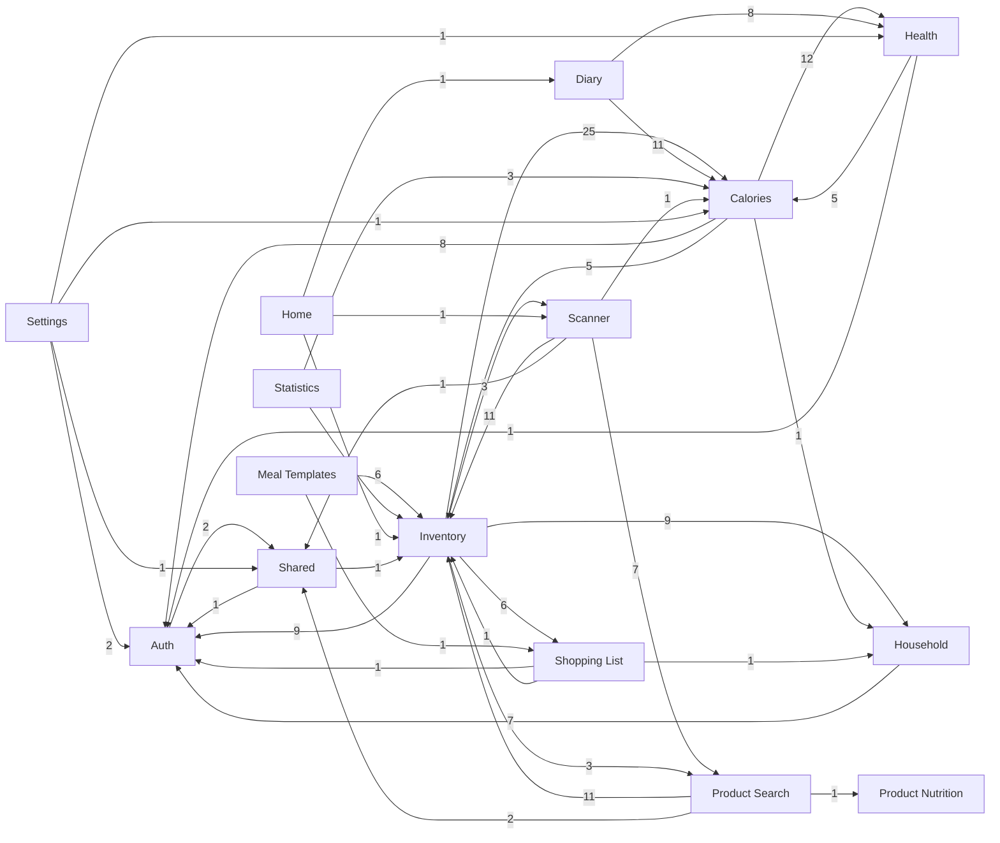

# Generated Feature Dependency Graph

This file is generated by `dart run tool/generate_feature_dependency_diagram.dart`.

It scans non-generated Dart files under `lib/features/**` and
extracts `import` and `export` references to `package:yamt/features/<feature>/...`.

- Generated at: `2026-05-04T17:02:03.261976Z`
- Features scanned: `15`
- Cross-feature edges: `39`

## Mermaid

## Edge Details

- `inventory -> calories` (25 files)
  - `lib/features/inventory/application/global_food_serving_suggestion_repository.dart`
  - `lib/features/inventory/application/inventory_calorie_bridge_flow.dart`
  - `lib/features/inventory/application/inventory_calorie_entry_post_persist_hook.dart`
  - `lib/features/inventory/application/inventory_item_eat_policy.dart`
  - `lib/features/inventory/application/prepared_meal_calorie_log_bridge.dart`
  - `... and 20 more`
- `calories -> health` (12 files)
  - `lib/features/calories/application/calorie_debug_dump_service.dart`
  - `lib/features/calories/domain/calorie_health_trend_snapshot.dart`
  - `lib/features/calories/domain/diary_activity_summary.dart`
  - `lib/features/calories/presentation/calorie_health_trends_page.dart`
  - `lib/features/calories/presentation/widgets/calorie_health_weight_list.dart`
  - `... and 7 more`
- `diary -> calories` (11 files)
  - `lib/features/diary/application/diary_activity_weight_service.dart`
  - `lib/features/diary/presentation/diary_intro_trigger_provider.dart`
  - `lib/features/diary/presentation/diary_page.dart`
  - `lib/features/diary/presentation/diary_weekly_checkin_dialog_scheduler.dart`
  - `lib/features/diary/presentation/widgets/diary_activity_details_card.dart`
  - `... and 6 more`
- `product_search -> inventory` (11 files)
  - `lib/features/product_search/data/product_ai_search_repository.dart`
  - `lib/features/product_search/domain/product_ai_search_models.dart`
  - `lib/features/product_search/domain/receipt_review_item_draft.dart`
  - `lib/features/product_search/presentation/widgets/inventory_product_candidate_widgets.dart`
  - `lib/features/product_search/presentation/widgets/inventory_receipt_candidate_picker_sheet.dart`
  - `... and 6 more`
- `scanner -> inventory` (11 files)
  - `lib/features/scanner/application/receipt_review_resolution_service.dart`
  - `lib/features/scanner/data/receipt_to_review_item_draft_mapper.dart`
  - `lib/features/scanner/domain/receipt_review_item_processor.dart`
  - `lib/features/scanner/domain/receipt_review_weight_confirmation.dart`
  - `lib/features/scanner/presentation/inventory_receipt_review_page.dart`
  - `... and 6 more`
- `inventory -> auth` (9 files)
  - `lib/features/inventory/application/global_food_serving_suggestion_repository.dart`
  - `lib/features/inventory/application/inventory_calorie_bridge_flow.dart`
  - `lib/features/inventory/data/global_barcode_candidate_repository.dart`
  - `lib/features/inventory/data/inventory_discard_event_repository.dart`
  - `lib/features/inventory/data/inventory_item_repository.dart`
  - `... and 4 more`
- `inventory -> household` (9 files)
  - `lib/features/inventory/application/prepared_meal_household_recovery.dart`
  - `lib/features/inventory/data/inventory_discard_event_repository.dart`
  - `lib/features/inventory/data/inventory_item_repository.dart`
  - `lib/features/inventory/data/prepared_meal_calorie_entry_commit_store.dart`
  - `lib/features/inventory/data/prepared_meal_repository.dart`
  - `... and 4 more`
- `calories -> auth` (8 files)
  - `lib/features/calories/data/burn_week_run_state_repository.dart`
  - `lib/features/calories/data/calorie_log_repository.dart`
  - `lib/features/calories/data/calorie_product_cache_repository.dart`
  - `lib/features/calories/data/calorie_settings_repository.dart`
  - `lib/features/calories/data/inventory_calorie_entry_commit_store.dart`
  - `... and 3 more`
- `diary -> health` (8 files)
  - `lib/features/diary/application/diary_activity_weight_service.dart`
  - `lib/features/diary/presentation/diary_intro_trigger_provider.dart`
  - `lib/features/diary/presentation/diary_page.dart`
  - `lib/features/diary/presentation/widgets/diary_activity_details_card.dart`
  - `lib/features/diary/presentation/widgets/diary_activity_weight_cards.dart`
  - `... and 3 more`
- `household -> auth` (7 files)
  - `lib/features/household/data/household_repository.dart`
  - `lib/features/household/presentation/household_page.dart`
  - `lib/features/household/presentation/widgets/household_sharing_card.dart`
  - `lib/features/household/provider/household_access_recovery_utils.dart`
  - `lib/features/household/provider/household_members_provider.dart`
  - `... and 2 more`
- `scanner -> product_search` (7 files)
  - `lib/features/scanner/application/receipt_review_resolution_service.dart`
  - `lib/features/scanner/domain/receipt_review_item_draft.dart`
  - `lib/features/scanner/presentation/widgets/inventory_receipt_candidate_picker_sheet.dart`
  - `lib/features/scanner/presentation/widgets/inventory_receipt_manual_product_form.dart`
  - `lib/features/scanner/presentation/widgets/inventory_receipt_manual_product_form_utils.dart`
  - `... and 2 more`
- `inventory -> shoppinglist` (6 files)
  - `lib/features/inventory/presentation/widgets/inventory_list/inventory_all_items_sliver.dart`
  - `lib/features/inventory/presentation/widgets/inventory_list/inventory_item_row_list_entry.dart`
  - `lib/features/inventory/presentation/widgets/inventory_list/inventory_list.dart`
  - `lib/features/inventory/presentation/widgets/inventory_list/inventory_receipt_groups_sliver.dart`
  - `lib/features/inventory/presentation/widgets/inventory_list/receipt_group_tile.dart`
  - `... and 1 more`
- `meal_templates -> inventory` (6 files)
  - `lib/features/meal_templates/presentation/meal_template_detail_page.dart`
  - `lib/features/meal_templates/presentation/meal_template_import_review_page.dart`
  - `lib/features/meal_templates/presentation/meal_templates_page.dart`
  - `lib/features/meal_templates/presentation/models/meal_template_import_review_args.dart`
  - `lib/features/meal_templates/presentation/widgets/meal_template_card.dart`
  - `... and 1 more`
- `calories -> inventory` (5 files)
  - `lib/features/calories/application/calorie_entry_delete_flow.dart`
  - `lib/features/calories/application/inventory_backed_calorie_entry_save_flow.dart`
  - `lib/features/calories/data/inventory_calorie_entry_commit_store.dart`
  - `lib/features/calories/presentation/calorie_entry_editor_page.dart`
  - `lib/features/calories/presentation/widgets/calorie_entry_editor_content.dart`
- `health -> calories` (5 files)
  - `lib/features/health/data/app_preferences_manual_health_weight_repository.dart`
  - `lib/features/health/data/firestore_manual_health_weight_repository.dart`
  - `lib/features/health/domain/manual_health_weight_entry.dart`
  - `lib/features/health/provider/health_connection_controller.dart`
  - `lib/features/health/provider/manual_health_weight_entries_controller.dart`
- `statistics -> inventory` (5 files)
  - `lib/features/statistics/domain/spending_metrics.dart`
  - `lib/features/statistics/domain/waste_metrics.dart`
  - `lib/features/statistics/presentation/statistics_page.dart`
  - `lib/features/statistics/presentation/views/statistics_spending_view.dart`
  - `lib/features/statistics/provider/statistics_waste_data_provider.dart`
- `inventory -> product_search` (3 files)
  - `lib/features/inventory/presentation/inventory_manual_add_page.dart`
  - `lib/features/inventory/presentation/widgets/inventory_barcode_candidate_picker_sheet.dart`
  - `lib/features/inventory/presentation/widgets/inventory_list/inventory_item_row/inventory_item_candidate_swap_flow.dart`
- `inventory -> scanner` (3 files)
  - `lib/features/inventory/presentation/inventory_action_sheet_flow.dart`
  - `lib/features/inventory/presentation/inventory_page.dart`
  - `lib/features/inventory/presentation/widgets/inventory_action_fab.dart`
- `statistics -> calories` (3 files)
  - `lib/features/statistics/domain/calorie_metrics.dart`
  - `lib/features/statistics/presentation/views/statistics_calories_view.dart`
  - `lib/features/statistics/provider/statistics_calorie_data_provider.dart`
- `auth -> shared` (2 files)
  - `lib/features/auth/widgets/login_form.dart`
  - `lib/features/auth/widgets/register_form.dart`
- `product_search -> shared` (2 files)
  - `lib/features/product_search/presentation/widgets/inventory_product_candidate_widgets.dart`
  - `lib/features/product_search/presentation/widgets/inventory_receipt_candidate_picker_sheet.dart`
- `settings -> auth` (2 files)
  - `lib/features/settings/account_page.dart`
  - `lib/features/settings/provider/account_controller.dart`
- `calories -> household` (1 file)
  - `lib/features/calories/data/inventory_calorie_entry_commit_store.dart`
- `health -> auth` (1 file)
  - `lib/features/health/provider/manual_health_weight_repository_provider.dart`
- `home -> diary` (1 file)
  - `lib/features/home/home_page.dart`
- `home -> inventory` (1 file)
  - `lib/features/home/home_page.dart`
- `home -> scanner` (1 file)
  - `lib/features/home/home_page.dart`
- `meal_templates -> shoppinglist` (1 file)
  - `lib/features/meal_templates/presentation/meal_template_detail_page.dart`
- `product_search -> product_nutrition` (1 file)
  - `lib/features/product_search/provider/manual_product_search_controller.dart`
- `scanner -> calories` (1 file)
  - `lib/features/scanner/application/receipt_review_resolution_service.dart`
- `scanner -> shared` (1 file)
  - `lib/features/scanner/presentation/widgets/inventory_receipt_review_item_card.dart`
- `settings -> calories` (1 file)
  - `lib/features/settings/settings_page.dart`
- `settings -> health` (1 file)
  - `lib/features/settings/settings_page.dart`
- `settings -> shared` (1 file)
  - `lib/features/settings/widgets/link_email_password_dialog.dart`
- `shared -> auth` (1 file)
  - `lib/features/shared/widgets/auth_form_components.dart`
- `shared -> inventory` (1 file)
  - `lib/features/shared/widgets/inventory_receipt_product_selection_widgets.dart`
- `shoppinglist -> auth` (1 file)
  - `lib/features/shoppinglist/data/shopping_list_repository.dart`
- `shoppinglist -> household` (1 file)
  - `lib/features/shoppinglist/data/shopping_list_repository.dart`
- `shoppinglist -> inventory` (1 file)
  - `lib/features/shoppinglist/application/shopping_list_operations.dart`
