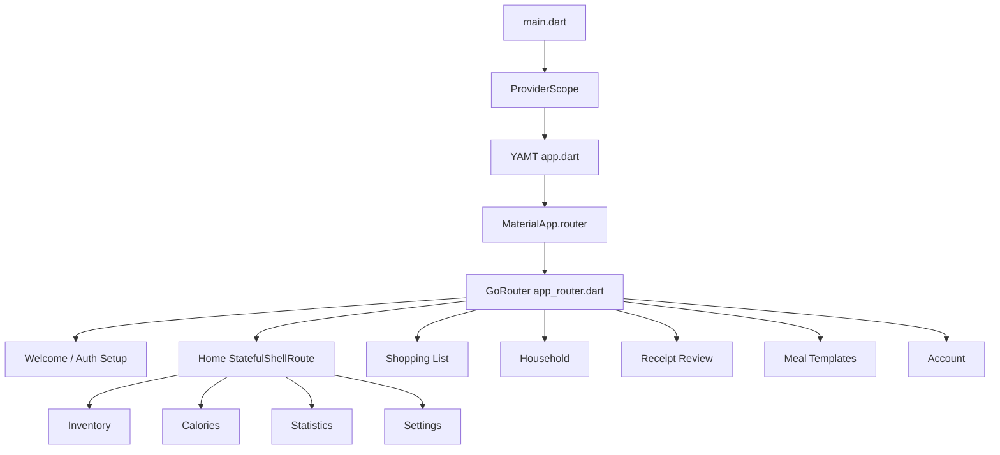
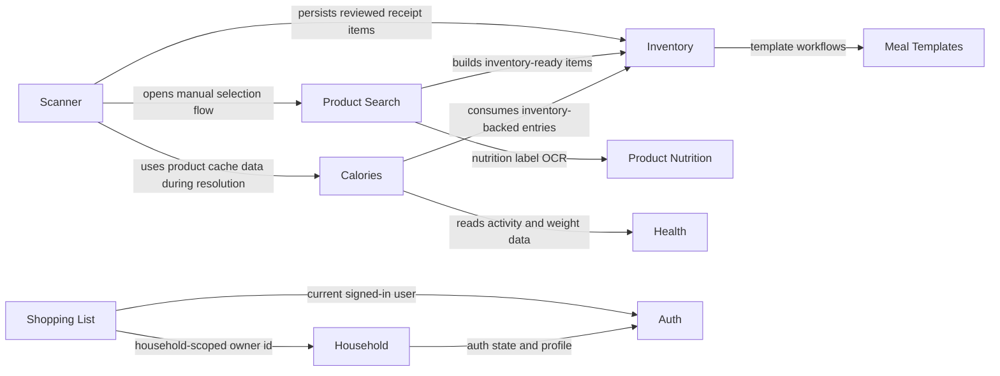
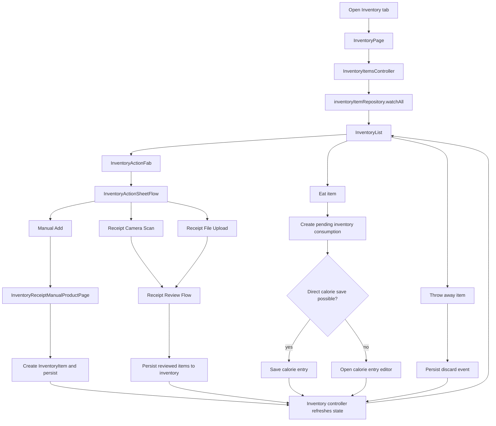

# Architecture Overview

This document is a living map of the app.

Use it when you want a fast answer to:
- where the app starts
- how navigation is structured
- which features depend on which other features
- where the current architecture boundaries are

## Generated Graph

- Auto-generated graph: `docs/architecture.generated.md`
- Regenerate with:
  `dart run tool/generate_feature_dependency_diagram.dart`
- The generated graph is import-based, so it is noisier but useful for
  spotting real dependency hotspots.

## How To Read This

- An arrow means "uses" or "depends on".
- An arrow does not mean ownership.
- Example: `Product Search -> Product Nutrition` means product search
  uses nutrition OCR, not that product nutrition is a screen in the
  product search flow.

## App Shell

## Feature Dependencies

## Inventory Main Flow

## Current Boundaries

- `main.dart` wires Firebase, app preferences, and the root
  `ProviderScope`.
- `app.dart` builds `MaterialApp.router` and applies app-wide concerns
  like theme and shared receipt listening.
- `app_router.dart` is the navigation hub.
- `scanner` is an orchestration-heavy feature. It pulls together receipt
  input, analysis, candidate resolution, and inventory persistence.
- `product_search` no longer depends on `calories` for OCR.
- `product_nutrition` now owns nutrition label OCR.
- `calories` still depends on `inventory` and `health`, which makes it
  one of the main cross-feature hubs.
- `shoppinglist` is scoped through `household` and `auth`.

## Good Entry Files

- `lib/main.dart`
- `lib/app.dart`
- `lib/core/router/app_router.dart`
- `lib/features/scanner/application/receipt_review_resolution_service.dart`
- `lib/features/product_nutrition/data/nutrition_label_ocr_repository.dart`
- `lib/features/calories/provider/calorie_health_trend_provider.dart`
- `lib/features/shoppinglist/data/shopping_list_repository.dart`

## Next Useful Diagrams

- route map with actual route names
- receipt scan sequence diagram
- inventory eat-to-calorie sequence diagram
- household-scoped data ownership flow
