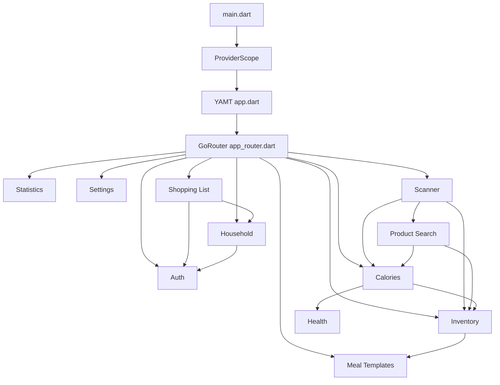

# Architecture Overview

This document is a living map of the app.

Start here when you want to understand:
- where the app starts
- how navigation is structured
- which features depend on other features

## High-Level Map

## Read The App From These Files

- `lib/main.dart`
- `lib/app.dart`
- `lib/core/router/app_router.dart`
- `lib/features/scanner/application/receipt_review_resolution_service.dart`
- `lib/features/calories/provider/calorie_health_trend_provider.dart`
- `lib/features/shoppinglist/data/shopping_list_repository.dart`

## Notes

- `main.dart` wires the app root and Riverpod overrides.
- `app.dart` builds `MaterialApp.router`.
- `app_router.dart` is the navigation hub.
- `scanner`, `calories`, and `inventory` are strong cross-feature hubs.
- `shoppinglist` depends on `household` and `auth` for scoping.

## Next Good Diagrams

- route map
- receipt scan flow
- inventory to calorie log flow
- household-scoped data ownership flow
